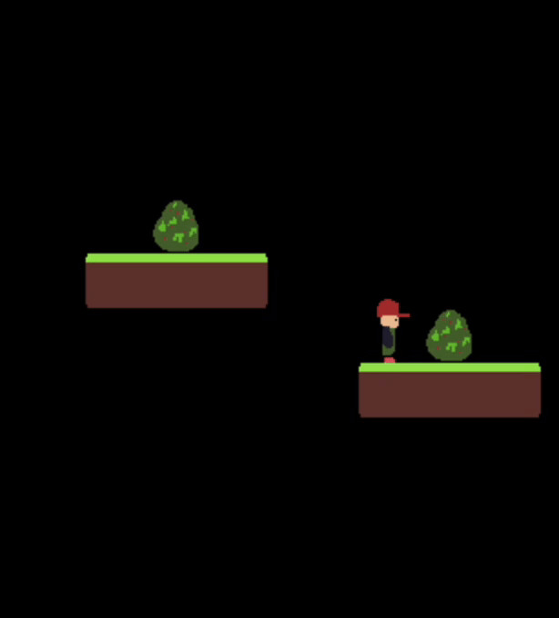

# VENGECS


**VENGECS** is a lightweight **C++ ECS (Entity-Component-System) framework** powered by **SDL2**, designed for 2D game development. It provides a modular, fast, and flexible architecture for creating games while keeping systems decoupled and efficient.

---

## Features

- **Entity-Component-System architecture**  
  Organize your game logic cleanly with entities, components, and systems.
- **Animation system**  
  Supports multi-frame sprite animations and horizontal flipping.
- **Physics & Gravity**  
  Rigidbody, collision detection, and gravity for realistic movement.
- **Input handling**  
  Configurable keyboard input system for player controls.
- **Scene management**  
  Switch between scenes while keeping persistent entities alive.
- **SDL2 integration**  
  Easy-to-use wrapper for window and renderer management.
- **Particle Engine**  
  Particle engine for explosions and other cool effects.
- **Audio FX**  
  Both audio fx and background music.
- **Contact Detection**  
  System to detect contacts between entities.
- **Trigger Colliders**  
  Colliders that don't produce a collision and can be used as triggers for doors etc.

## Future Features
- **HUD**
  Overlay menu system coming soon


## Getting Started

### Prerequisites

- C++17 or higher
- SDL2, SDL2_image and SDL2_mixer installed

**macOS (Homebrew)**

```bash
brew install sdl2 sdl2_image sdl2_mixer
```

**Linux (APT)**

```bash
sudo apt install libsdl2-dev libsdl2-image-dev libsdl2-mixer-dev
```

**Build**

```bash
mkdir build
cd build
cmake ..
make
```

**Run The Game**

```bash
make run
```
